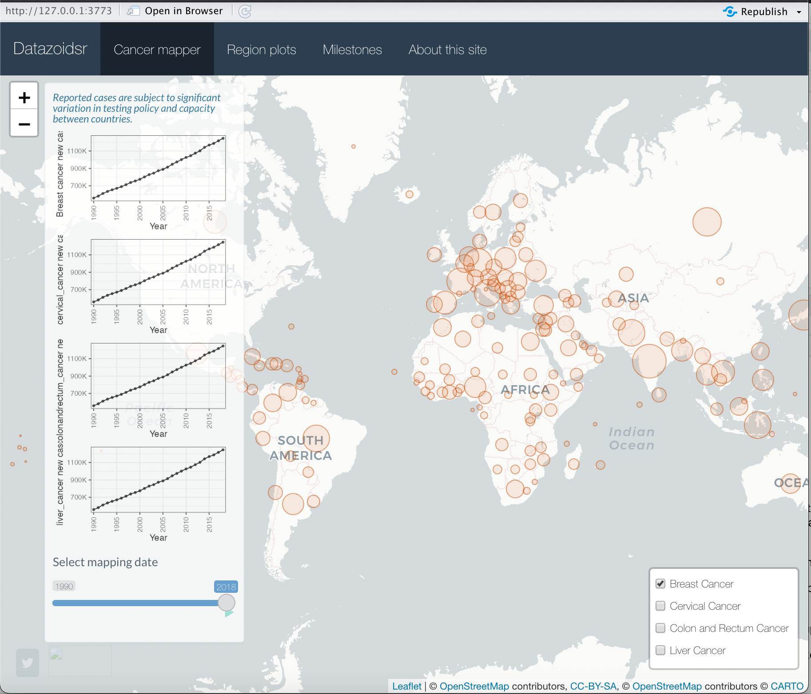

# RshinyProject

## Introduction
This site is developed for NEU COE IE 6600 Computation and Visualization for Analytics Course Project (2022 fall term) 
Copyright belongs to NEU COE IE 6600 Class(2022 fall term) 

## Background Information
Cancer is a leading cause of death worldwide, accounting for nearly 10 million deaths in 2020, or nearly one in six deaths.(WHO) 
The goal of this project is to identify and analyze the allocation of the 4 most common cancers (breast, cervical, colon and rectum, and liver cancers) in different continents and different countries.

## 1st Page

