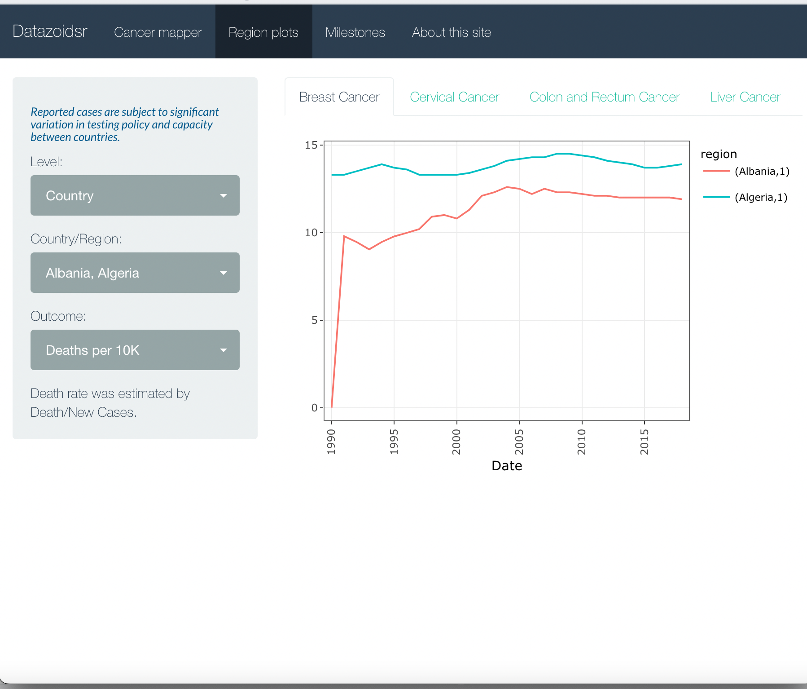
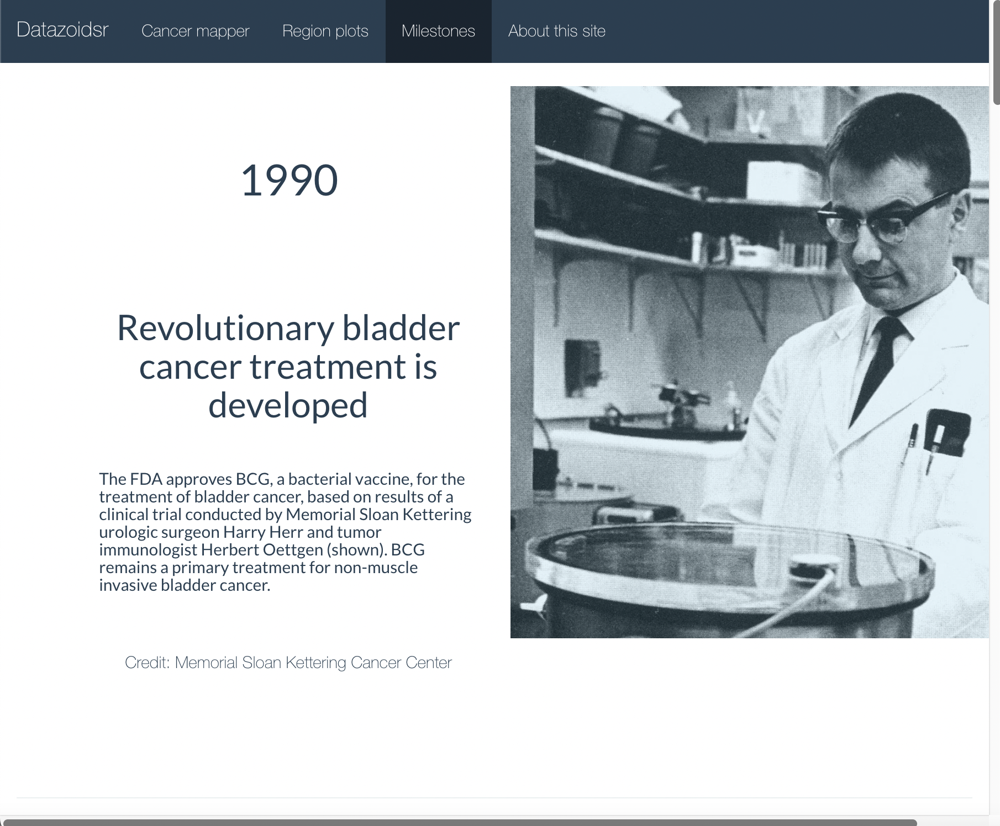

# RshinyProject

## Introduction
This website has been created for the purpose of NEU COE IE 6600 Computation and Visualization for Analytics Course Project (Fall 2022 semester). The NEU COE IE 6600 class (Fall 2022 semester) holds the copyright for this website.

## Background Information
Cancer is responsible for a significant number of deaths globally, accounting for almost 10 million deaths in 2020, which is approximately one in six deaths, according to the World Health Organization (WHO). The aim of this project is to identify and examine the incidence of the four most prevalent cancers (breast, cervical, colon and rectum, and liver cancers) in various continents and countries.

## 1st Page
### Wordwide Allocation

## 2nd Page
### Time series

## 3rd Page
### Milestone in Cancer Treatment

